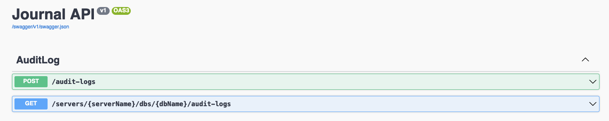
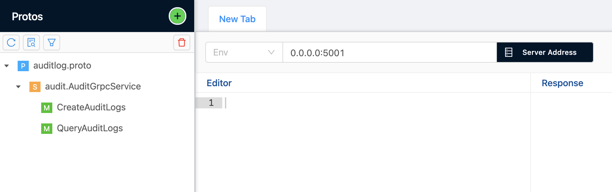

# Journal

This project is designed for collecting value changing from your different db.

You can access swagger screen on `http://localhost:5000` and send grpc request via `http://localhost:5001`.

### RUN

Project needs JournalDb in Postgres.

- If you have docker, you can use docker-compose file from root path.
- If you have Postgres running on cloud or local machine, you can change connection from `appsettings.json`.  

